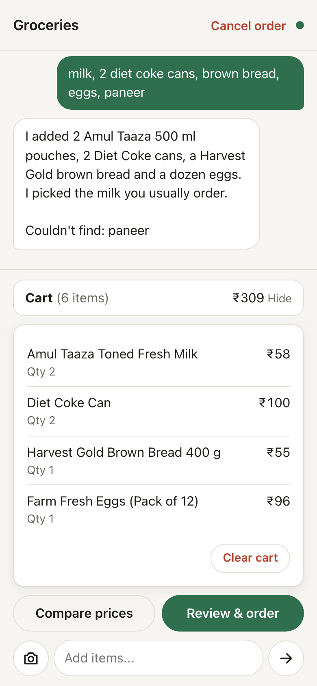
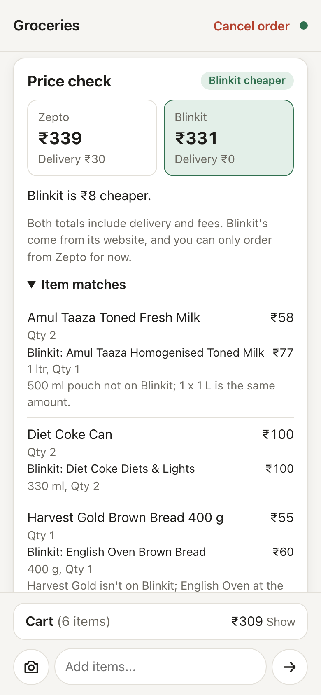
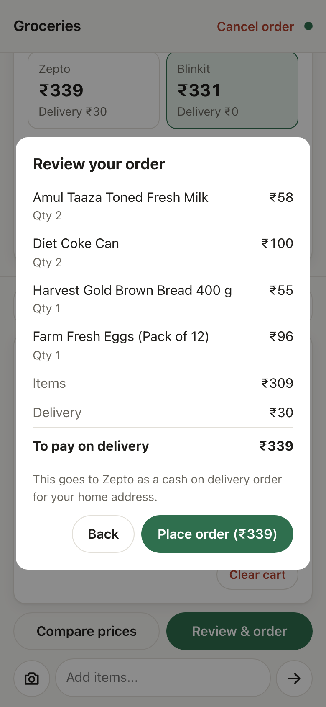
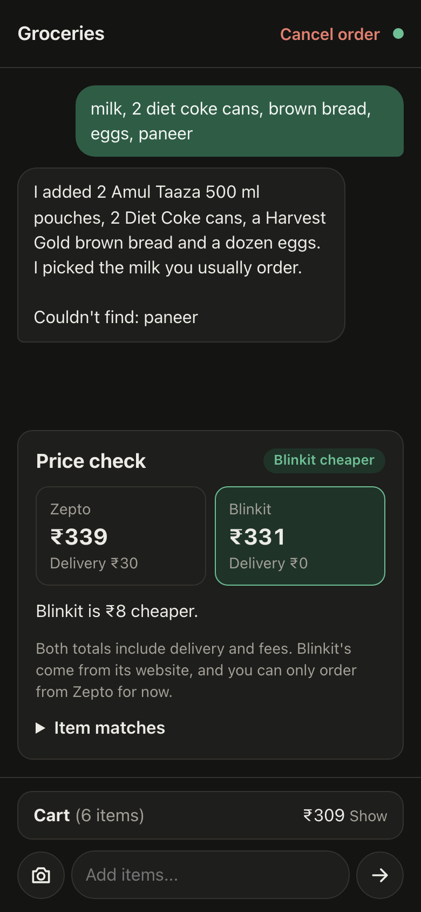

# Grocery Comparison

[](https://github.com/wigeria/grocery-comparison/actions/workflows/ci.yml)
[](LICENSE)

My dad mentioned one morning that his monthly grocery run would probably be cheaper if we just
bought everything online. The catch was that he couldn't be bothered to add every item to a
cart one at a time. So I figured, why not just take a photo of his shopping slip and have it
read and fill the cart for him.

That's what this is. You type a list (or take a photo of a handwritten one), Claude fills a
Zepto cart, and the app checks what the same cart would cost on Blinkit. Nothing gets ordered
until you've seen the final amount and hit approve, and it's always cash on delivery.

It runs on an old laptop at home and I use it from my phone.

<p>
  
  
  
  
</p>

## How it works

You send something like "2 litres of milk, eggs and brown bread". Claude searches Zepto,
leans towards the brands you've ordered before, adds things to the cart and tells you if it
couldn't find something. You can keep chatting to change things.

Hit "Compare prices" and it looks up each item on Blinkit too. When Blinkit doesn't have the
exact product it picks the closest one and says what's different (a different brand, a 1 L
pack instead of two 500 ml ones). Then it compares the actual totals, delivery fees included,
since that's often what decides it.

"Review & order" shows you the bill from Zepto. If it looks right, you place the order.

## Keeping it from ordering the wrong thing

These are real orders with real money, so I was careful about this part.

Claude never gets access to Zepto's ordering or payment tools. It can search and edit the
cart, and every tool call goes through a check that also locks it to my saved address. The
actual order is placed by plain code, not by the model.

When you review an order, the app keeps a fingerprint of exactly what you saw: items, prices
and total. Approving sends that back, and the app re-reads the live cart before ordering. If
anything changed in between (say someone edited the cart in the Zepto app), you get the new
total to look at instead of an order.

If placing an order fails halfway, the app doesn't retry. It marks the order as "may have gone
through" and asks you to check the Zepto app, because a duplicate order is worse than a
missing one.

There's more on all of this in [docs/architecture.md](docs/architecture.md).

## Stack

Python and FastAPI, the [Claude Agent SDK](https://github.com/anthropics/claude-agent-sdk-python),
[Zepto's official MCP server](https://github.com/zeptonow/mcp), SQLite, plain JavaScript for
the frontend, and Docker Compose with Caddy for HTTPS.

## Before you use it

It places real orders on your Zepto account.

There's no login screen. It's meant for a home network only, and anyone who can open the page
can order on your account, so don't put it on the internet.

The Blinkit part is unofficial. Blinkit doesn't have a public API, so the app makes the same
read-only requests its website does, based on the research in
[yniks/blinkit-mcp](https://github.com/yniks/blinkit-mcp). It never logs in or orders anything
on Blinkit. It'll probably break at some point when Blinkit changes their site, and the prices
come from the website, which aren't always the same as the app's. Keep it to personal use.

This isn't affiliated with Zepto, Blinkit or Anthropic. Both stores only operate in India.

## Try it without an account

There's a demo that runs the real UI against fake data, so you can click around without
ordering anything.

```bash
python3 -m venv .venv && .venv/bin/pip install -e ".[dev]"
.venv/bin/python scripts/demo_server.py     # then open http://localhost:8001
```

## Setup

You'll need a Zepto account with a saved address, a Claude subscription, and Docker.

### 1. Config

```bash
cp .env.example .env && chmod 600 .env
cp config.example.toml config.toml
```

In `.env`, paste a token from `claude setup-token` into `CLAUDE_CODE_OAUTH_TOKEN`, and set
`APP_UID` / `APP_GID` to whatever `id -u` and `id -g` print. `SITE_ADDRESS` and `CADDY_TLS`
are covered under [HTTPS](#https).

`config.toml` needs your delivery address id and its coordinates. You'll get those in the next
step.

### 2. Log in to Zepto

This only has to happen once. Zepto's login only redirects back to `localhost`, so if you're
setting this up on a server, forward the port over SSH:

```bash
ssh -L 8765:localhost:8765 <server>
docker compose run --rm -p 127.0.0.1:8765:8765 -e ZEPTO_LOGIN_BIND_HOST=0.0.0.0 \
    app python scripts/zepto_login.py
docker compose run --rm app python scripts/list_zepto_addresses.py
```

Open the URL it prints, log in with your phone number and OTP, and the tokens get saved to
`data/`. They refresh on their own after that. The second command prints your saved addresses
with the id and coordinates to put in `config.toml`.

### 3. Run it

```bash
docker compose up -d --build
```

Order history goes in `db/` and everything else (tokens, photos, Claude's sessions) in `data/`.
Both live in the project folder, so rebuilding doesn't lose anything.

## HTTPS

`CADDY_TLS` controls where Caddy gets its certificate from.

`internal` is for trying things locally. Caddy signs its own certificate, so the browser will
complain. Use it with `SITE_ADDRESS=localhost`.

`duckdns` gets you a proper certificate on your home network:

1. Make a free name on [duckdns.org](https://www.duckdns.org), point it at your server's LAN
   IP, and copy the token.
2. Set `SITE_ADDRESS=<name>.duckdns.org`, `CADDY_TLS=duckdns` and `DUCKDNS_TOKEN=<token>` in
   `.env`.
3. Give the server a fixed IP in your router's DHCP settings so it doesn't move.

Caddy proves it owns the name through DuckDNS, so nothing has to be open to the internet. If
the name won't resolve at home, your router (or Pi-hole, NextDNS, etc.) is probably blocking
public names that point at private IPs. Look for "DNS rebinding protection" and allow the name.

## Development

```bash
.venv/bin/pytest -q          # no network needed, everything external is faked
.venv/bin/ruff check . && .venv/bin/ruff format --check .
.venv/bin/python -m zepto_ordering.main     # http://localhost:8000, needs the setup above
```

The Docker image installs exact versions from `requirements.lock`. If you change dependencies
in `pyproject.toml`, regenerate it on Linux so the versions match the image:

```bash
docker run --rm --platform linux/amd64 -v "$PWD/pyproject.toml:/src/pyproject.toml:ro" \
    python:3.12-slim sh -c 'cd /src && python -c "import tomllib; \
    print(chr(10).join(tomllib.load(open(\"pyproject.toml\",\"rb\"))[\"project\"][\"dependencies\"]))" \
    > /tmp/req.txt && pip install -q -r /tmp/req.txt && pip freeze' > requirements.lock
```

## License

[MIT](LICENSE)
